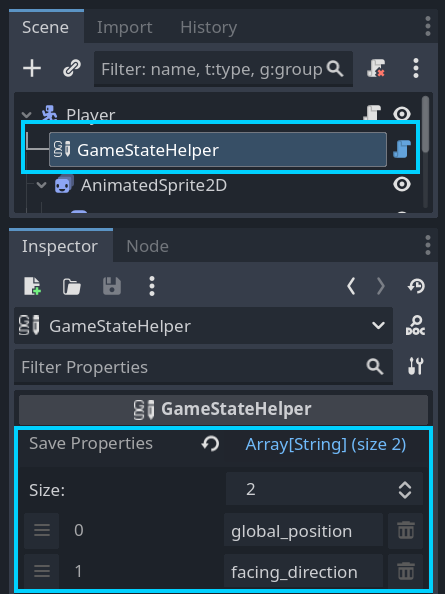
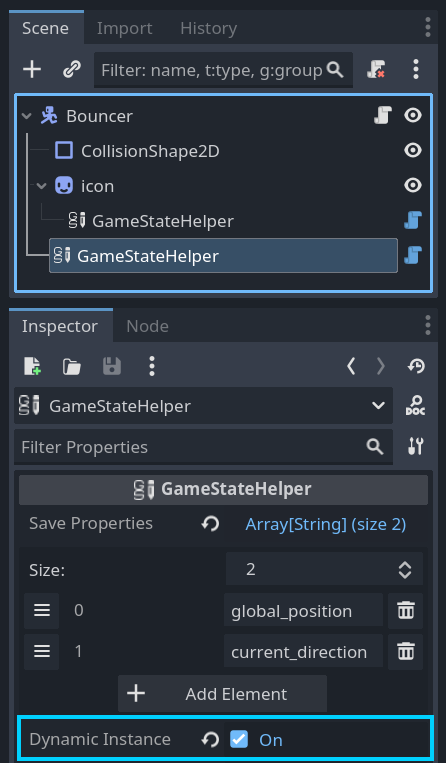
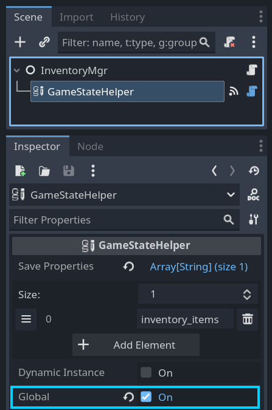

# Godot Game State Saver Plugin

This plugin maintains game object state (property values) between scene changes as well as saves that state to a file.  It handles the following scenarios for you:

1. Re-applying property values to game objects when a scene is reloaded.  For example if an object is moved by the player, its position can be maintained so that it is in the new position when the scene is reloaded.
2. Re-instance a game object that was dynamically added to the scene.  For example if an enemy drops an item and you want it to stay in the game even when the player leaves the scene, the plugin will re-instance this object when that scene is reloaded.  Of course other properties can be persisted too, like the objects position.
3. Re-free a game object that was freed from the scene.  For example, a quest item is added to a scene at design time in the Godot editor, and so is normally always present.  However, the player can pick up the item which removes the item from the scene tree at runtime.  This plugin will note the fact the item was freed and re-free it when the scene is reloaded.
4. Share values between scenes.  This is done with a "global" section of the game state data.  This allows something happening in one scene to affect something else in another.  For example, a switch in once scene can set a global value to true which unlocks a door in another scene.

The plugin takes care of all of the above, but if you have special state logic you need to add for a game object, you can hook into the state system by connecting to certain signals (described below).

## Installation
This plugin can be installed via the Godot asset library or you can clone or download the repository and copy the addon folder into your game.

## Demos
There are two demos available for the plugin.  A very simple demo is in the addons folder (res://addons/game_state_saver/demo/demo_title.tscn) so that is is included when installing from the asset library.  A more complete demo is available in the plugin's GitHub repository.  To get this demo please clone (do not download!) the entire GitHub repository and open its project.

## How to Use
### Setting Up Game Objects
For the game object you wish to save state for, add a GameStateHelper node as a child node.  Then add all of the names of the properties you want to save to the Save Properties array.

In the following example, the Player object's global_position and a custom property called facing_direction are saved.

If the game object is a dynamically instanced child scene (like a spawned enemy), you will want to check the Dynamic Instance property of the GameStateHelper.

In the following example the Bouncer object is set to Dynamic Instance.  This means that when the scene is reloaded, bouncers will be re-instanced and added back into the scene tree.

Also note that there is a second GameStateHelper in the above example.  This preserves the Icon's modulate as the bouncer is given a random color.  You can have as many GameStateHelper nodes as needed.

If the game state for the object is not specific to a scene and should be the same no matter what scene the object is in, check the Global property of the GameStateHelper.

In the following example an InventoryMgr is set to global so that the array of inventory items will always be present and the same for every scene.

### Must Do This Before Every Scene Change
Before changing scenes in your game, you must call the GameStateService's on_scene_transitioning() function.  This causes the service to collect all of the game state so the next time the current scene is loaded the game state can be re-applied.

For example:

	GameStateService.on_scene_transitioning()
	get_tree().change_scene_to_file("res://path/to/scene.tscn")

### I need Special Logic During Loading/Saving State
Not everything can be boiled down to a property value and you may occasionally need to calculate or obtain a value for state with some code.  The GameStateHelper node has two signals that you can use for this called loading_data(data:Dictionary) and saving_data(data:Dictionary).  All you need to do is add entries to the dictionary when saving or access entries when loading in the callback functions connected to these signals.  NOTE: custom data entries may not be present in the dictionary for the loading_data() signal as that signal is emitted before the saving_data() signal.

### Starting A New Game
Whenever a new game is started, you should call the GameStateService's new_game() function.  This clears the game state.  If this is not done, then game state from previous play sessions will be applied and would cause strange things to happen in the game.

For example:

   	GameStateService.new_game()
   	get_tree().change_scene_to_file("res://levels/level1.tscn")

### Saving Game State to Save Game Files
The GameStateService only stores game state data in memory till its save_game_state() function is called.  All you need to do is pass it a file name.

for example:

    GameStateService.save_game_state("user://saved_gamed/save_game1.json")

Along with the saved game file a ".dat" file is created that contains a hash of the save file.  This hash is checked whenever a saved game is loaded.

### Loading Game State from Save Game Files
To load a saved game, just call the load_game_state() function of the GameStateService autoload.  If the saved game file is successfully loaded, a path to a scene file is returned, which was the current scene when the save game file was made.

For example:

    var scene_file_path := GameStateService.load_game_state("user://saved_gamed/save_game1.json")
    if !scene_file_path: # nothing returned on error - check output
        return
    get_tree().change_scene_to_file(scene_file_path)

## Reference

### GameStateHelper

Use this node to save property values of its parent node.

### Properties

- Save Properties:Array[String] - List of property names of the GameStateHelper's parent node to maintain as game state.
- Dynamic Instance - Marks scene as dynamic: it will be re-instanced when the scene it was dynamically added to is re-loaded.
- Global - Saved properties will be stored in a global section of game state as apposed to a section for a specific scene.

### Signals

- loading_data(data:Dictionary) - emitted when re-applying saved state.  Custom data entries added when saving data can be accessed, but be sure to check that they are present as loading_data() is emitted before saving_data() is when a scene first loads.
- saving_data(data:Dictionary) - emitted when saving state.  Added entries to the data dictionary will be available later when the loading_data() signal is emitted.

### GameStateService
The autoload that manages game state.

#### Functions

- dump_game_state() - Creates a JSON file with the raw game state dictionary data.  This is used for debugging.
- get_game_state_string(refresh_state:bool) - Returns JSON string of current game state.  Passing in true causes the game state to be updated.
- get_global_state_value(key:String) - Gets a value from the global game state.
- load_game_state(path: String) -> String - Loads game state data from given file path.  If loading is successful, returns scene path that was current when the save file was created.  Use this path in a call to SceneTree.change_scene_to_file().
- new_game() - Resets game state for a new game.
- save_game_state(path: String) -> bool - Saves game state to the given file path.  Another file with an md5 hash will be saved along with the file with the extension ".dat".  The hash will be used during load() to detect if the save game file has been altered.
- set_global_state_value(key: String, value) - Sets a value from the global game state.

##  Support This and Other Free Tools
If you would like to support my development work to maintain this and other such projects you can do so at https://www.buymeacoffee.com/jlothamer.

